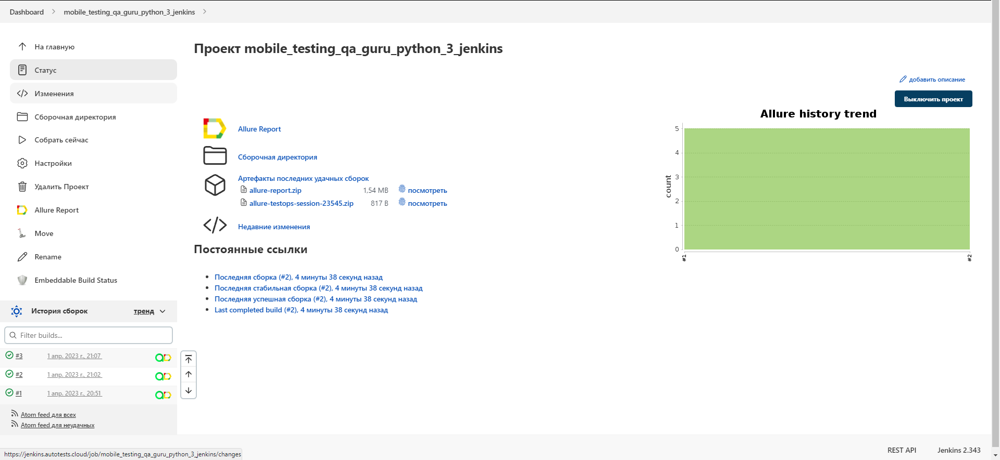
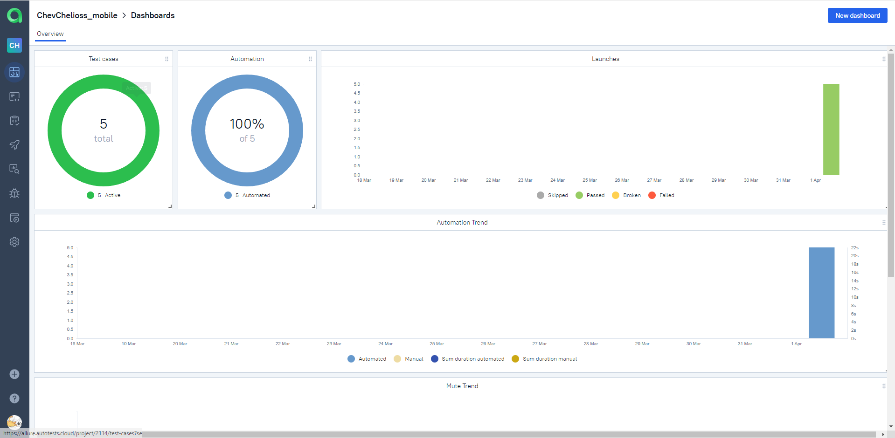
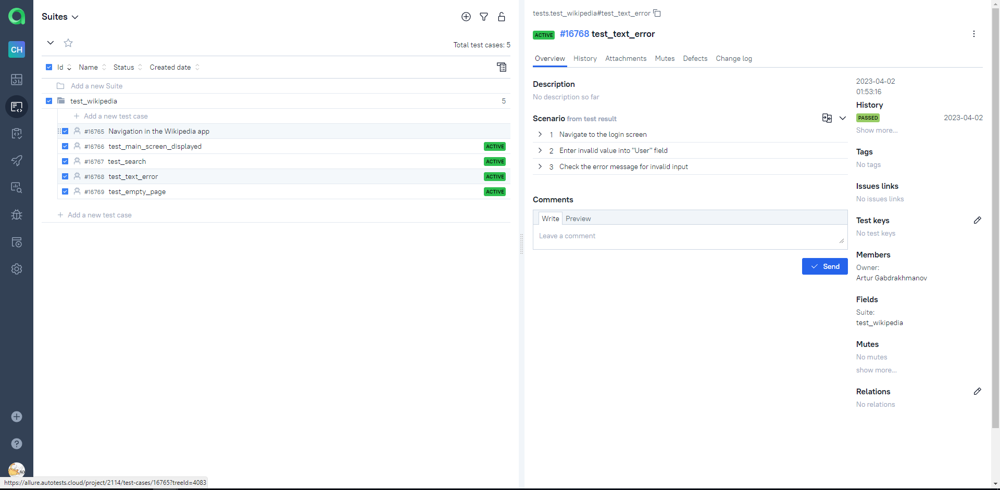
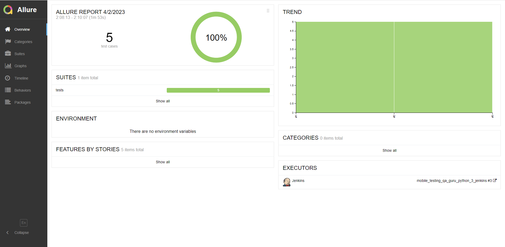
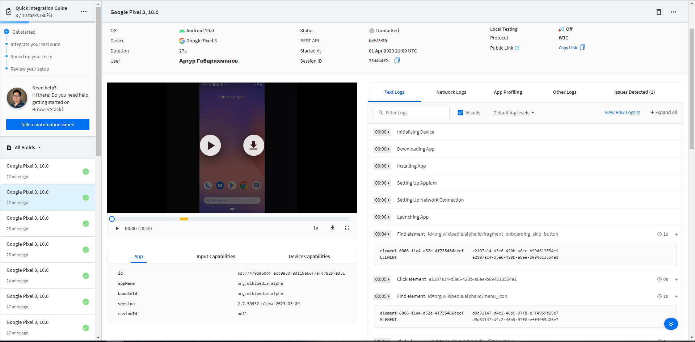
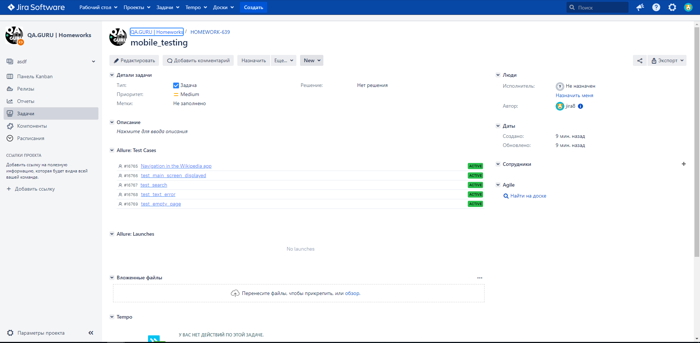
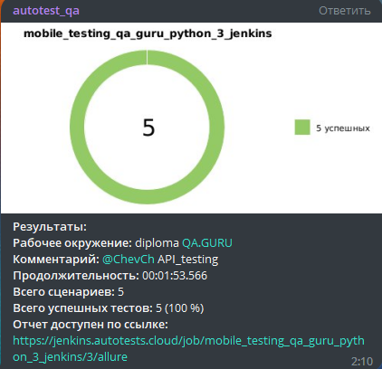

# Проект тестирования интерфейса (Mobile app)
#### предназначен для тестирования API-функционала с использованием библиотеки pytest, фреймворка requests и библиотеки для валидации данных voluptuous. В проекте реализовано несколько тестовых сценариев, которые покрывают основные CRUD-операции (создание, чтение, обновление и удаление) для ресурса "Пользователи" (users) в рамках REST API сервиса [Reqres](https://reqres.in/).

<!-- Технологии -->

### Используемые технологии

<code></code>
<code></code>
<code></code>
<code></code>
<code></code>
<code></code>
<code></code>
<code></code>
<code></code>
<code></code>
<code></code>
<code></code>

### Для запуска тестов необходимо установить следующие зависимости:

- Python 3
- Библиотеки pytest, requests, allure-pytest, voluptuous
- WebDriver для браузера Chrome
- Приложение Allure для формирования отчетов

### Проект состоит из двух тестовых наборов:

<b>API тестирование функционала - test_reqres</b>

<ul>
  <li>Тест на проверку успешного создания пользователя</li>
  <li>Тест на проверку успешного обновления данных пользователя</li>
  <li>Тест на проверку успешной регистрации пользователя</li>
  <li>Тест на проверку неудачной регистрации пользователя</li>
  <li>Тест на проверку успешного удаления пользователя</li>
</ul>

<b>UI/API тестирование функционала - test_demowebshop</b>

<ul>
  <li>Тест на успешную авторизацию</li>
  <li>Тест на обновление информации о пользователе</li>
  <li>Тест на добавление товара в корзину и проверку содержимого корзины</li>
  <li>Тест на удаление товара из корзины</li>
  <li>Тест на проверку функциональности поиска товаров</li>
  <li>Тест на успешный выход из аккаунта</li>
</ul>

### Видео о прохождении одного из тестов

<!-- Jenkins -->

##  Jenkins
### [JOB](https://jenkins.autotests.cloud/job/API_testing_qa_guru_python_3_jenkins/)
##### Кликните "Собрать сейчас"
запущенную сборку вы увидите в "Истории сборки" 

там же рядом появятся две кнопки - зеленая откроет для нас allure test ops, а желтая allure report  

<!-- Allure TestOps -->

##  Allure TestOps
### [DASHBOARD](https://allure.autotests.cloud/launch/21112)
##### предоставляет общий обзор о процессе тестирования проекта, а также предоставляет различные метрики и отчеты для принятия решений на основе данных тестирования. Он позволяет визуализировать результаты тестирования и обнаруживать проблемы в продукте, что может помочь командам разработки улучшить качество своего продукта

##### описывает тест-кейсы, которые должны быть выполнены для тестирования конкретной функциональности продукта. Это позволяет лучше структурировать и организовать процесс тестирования, а также легко отслеживать прогресс и результаты тестирования

<!-- Allure report -->

##  Allure Report
### [ALLURE REPORT](https://allure.autotests.cloud/launch/21112)
##### это инструмент для генерации отчетов о результатах тестирования, которые позволяют наглядно отображать статус выполнения тестов, результаты прохождения их шагов, а также информацию о возможных проблемах и ошибках

<!-- Browserstack -->

##  Окно запуска теста на Browserstack

<!-- Jira -->

##  Интеграция с Jira

<!-- Telegram -->

##  Telegram
##### в проект добавлена функция отправки Allure report с ключевой информацией в Telegram

